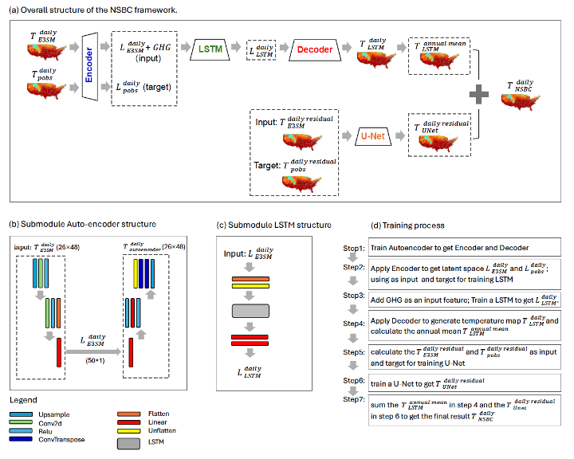

# NSBC
Overview.
This work develops the NSBC (non-stationary bias correction) methodology to correct temperature projection bias from E3SM.
The NSBC deep learning framework consists of a three-part architecture: an auto-encoder for compressing the spatial information, an LSTM for predicting annual temperature mean, and a U-Net for capturing the residual bias in temperature. The non-stationary bias correction (NSBC) framework can correct the non-stationarity of the biases of the climate models, which significantly improves the accuracy of future temperature prediction and improves the overestimation of extreme high temperatures that many existing bias correction methods suffer from. The detail structure of the NSBC framework is as follows.
 
Below we provide guidance for applying NSBC to correct the Energy Exascale Earth System Model (E3SM; Golaz et al. 2019) daily temperature projection over the contiguous United States (CONUS).
Getting started
1. Obtain the historical climate simulation and observation data.
The E3SM simulation data are available through https://aims2.llnl.gov/search/cmip6/.
The pseudo observations, the Geophysical Fluid Dynamics Laboratory (GFDL)-ESM4 model (Krasting et al., 2018) are available through https://aims2.llnl.gov/search/cmip6/.
The spatial resolution of E3SM and pseudo observation datasets are both regridded to a common 1° resolution grid using conservative interpolation. The regridded E3SM and pseudo observation with 1° resolution can be found throught ./data/.
2. Train the Auto-encoder model.
Python 0-autoencoder.py
3. Train the LSTM
Python 1-LSTM.py
4. Generate the annual mean temperature based on trained LSTM
Python 2-generate_annual_mean_LSTM.py
5. Train the U-Net.
Python 3-unet.py
6. Evaluation and compared with the baseline
Python 4_evaluation.py
License
This project is licensed under the MIT License - see the LICENSE.md file for details
Release
This work was performed under the auspices of the U.S. Department of Energy by
Lawrence Livermore National Laboratory under Contract DE-AC52-07NA27344
and was supported by the LLNL-LDRD Program under Project No. 22-SI-008, and
it was released as LLNL-SM-870246 and CP03012.
